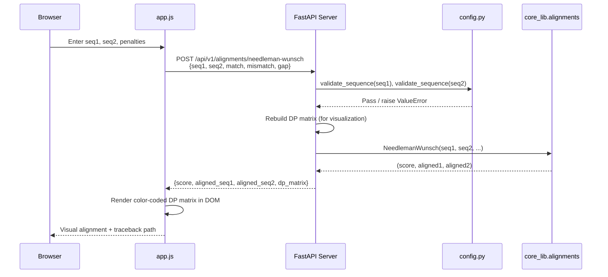
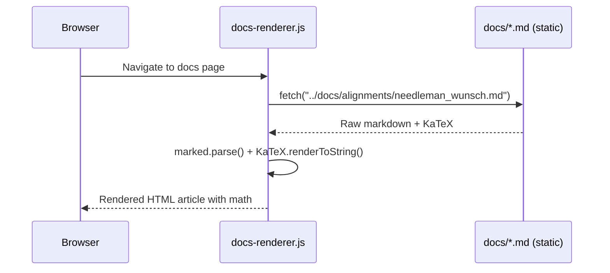
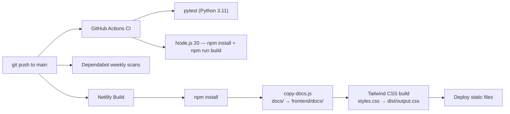

# Bioinformatics Docs

A Python bioinformatics toolkit implementing sequence alignment, distance metrics, sequence transformations, and file processing algorithms.

[Documentation](https://bioinformatics-docs.netlify.app/pages/docs.html) • [Benchmarks](https://bioinformatics-docs.netlify.app/pages/docs.html#benchmarks/analysis_report.md) • [Website](https://bioinformatics-docs.netlify.app/) • [Source Code](https://github.com/ChakradhwajB/Bioinformatics-Docs)

---


---

## Features

### Sequence Alignment

- **Needleman-Wunsch**: Global homology alignments utilizing dynamic programming with traceback visualization.
- **Smith-Waterman**: Local sequence alignments focusing on highly similar subsequences.

### Distance Metrics

- **Hamming Distance**: Linear mutation metric comparing identical-length strings.
- **Levenshtein Distance**: Dynamic programming edit distance calculating insertions, deletions, and substitutions.

### Genetic Transformations

- **Complement & Reverse Complement**: Standard DNA/RNA strand conversions.
- **Transcription & Translation**: DNA-to-RNA transcription and RNA-to-Peptide codon mapping.
- **Motif Search**: Sliding window target pattern mapping.

### File Processing

- **FASTA Parsing**: High-performance, low-memory line-by-line file streaming and header stats parser.
- **FASTA Writing**: Output record generators.
- **Input Validation**: Strict DNA/RNA vocabulary check tools.

### Engineering

- **Unit Tested**: $40+$ test assertions validating edge cases, penalties, and parser bounds.
- **Complexity Benchmarked**: Empirical validation logs matching theoretical $\mathcal{O}(n)$ and $\mathcal{O}(n^2)$ behavior.
- **Documented**: Educational articles with KaTeX math rendering.

---

## Installation

Clone the repository and install dependencies:

```bash
git clone https://github.com/ChakradhwajB/Bioinformatics-Docs.git
cd Bioinformatics-Docs
pip install -r requirements.txt
```

---

## Quick Start

You can run calculations directly in Python or launch the local interactive web dashboard.

#### 1. Global Sequence Alignment

```python
from core_lib.alignments import NeedlemanWunsch

# Align sequences with Match=1, Mismatch=-1, Gap=-1 penalties
score, align1, align2 = NeedlemanWunsch(
    "GCATGCG",
    "GATTACA",
    match=1,
    mismatch=-1,
    gap=-1
)

print(f"Alignment Score: {score}")
print(f"Seq 1: {align1}")
print(f"Seq 2: {align2}")
# Output:
# Alignment Score: 0
# Seq 1: G-CATGCG
# Seq 2: GA-T-ACA
```

#### 2. Motif Searching

```python
from core_lib.genetics import FindMotif

# Locate all offsets of a target motif in a genome sequence
positions = FindMotif(
    "GATATATGCATATACTT",
    "ATAT"
)
print(f"Motif starts at 1-based indexed positions: {positions}")
# Output: [2, 4, 10]
```

### Local Quick Start

Start the FastAPI backend server:

```bash
python -m uvicorn server.main:app --reload
```

Then, double-click `frontend/index.html` to open the visual alignment canvas in your web browser.

---

## Implemented Algorithms

| Algorithm                           | Category           | Time Complexity          | Space Complexity             |
| :---------------------------------- | :----------------- | :----------------------- | :--------------------------- |
| **Hamming Distance**                | Distance Metric    | $\mathcal{O}(L)$         | $\mathcal{O}(1)$             |
| **Levenshtein Distance**            | Distance Metric    | $\mathcal{O}(n \cdot m)$ | $\mathcal{O}(n \cdot m)$     |
| **Needleman-Wunsch**                | Global Alignment   | $\mathcal{O}(n \cdot m)$ | $\mathcal{O}(n \cdot m)$     |
| **Smith-Waterman**                  | Local Alignment    | $\mathcal{O}(n \cdot m)$ | $\mathcal{O}(n \cdot m)$     |
| **Complement / Reverse Complement** | Sequence Transform | $\mathcal{O}(n)$         | $\mathcal{O}(n)$             |
| **Transcription / Translation**     | Sequence Transform | $\mathcal{O}(n)$         | $\mathcal{O}(n)$             |
| **Motif Search**                    | Pattern Matching   | $\mathcal{O}(n \cdot m)$ | $\mathcal{O}(n)$             |
| **FASTA Ingestion Parser**          | File IO            | $\mathcal{O}(n)$         | $\mathcal{O}(1)$ (Streaming) |

---

## Benchmark Results

Empirical runtime validations show that our implementations match theoretical complexity behavior exactly.


- **Linear operations** (Transcription, translation, Hamming distance) scale strictly as $\mathcal{O}(n)$ up to $100,000$ bases.
- **Quadratic alignment algorithms** (Needleman-Wunsch, Smith-Waterman) scale as $\mathcal{O}(n^2)$ and are capped to safe limits of $50$ bases on free hosting tiers to prevent out-of-memory errors under the strict $512\text{ MB}$ limit.
- **Empirical validation** proves the quadratic behavior with log-log regression slope calculation: $d(\log T)/d(\log N) \approx 2.01$.

---

## System Architecture Overview

```mermaid
graph TD
    subgraph Frontend ["Frontend (Static HTML/JS — Netlify)"]
        A["index.html — Landing Page"]
        B["learn.html — Module Index"]
        C["pages/*.html — 11 Module Pages"]
        D["src/app.js — API Client + Init"]
        D2["src/needleman_wunsch.js"]
        D3["src/smith_waterman.js"]
        D4["src/distances.js"]
        D5["src/genetics.js, io.js, kmers.js, ..."]
        E["src/docs-renderer.js — Markdown Renderer"]
        F["src/quiz.js — Practice Challenges"]
        G["src/sandbox.js — Pyodide WASM Sandbox"]
        H["src/search.js — Full-text Search"]
    end

    subgraph Server ["Server (FastAPI — Render)"]
        I["server/main.py — App + CORS + Routing"]
        I2["endpoints/config.py — Centralized Guards"]
        J["endpoints/alignments.py"]
        K["endpoints/genetics.py"]
        L["endpoints/io.py"]
        M["endpoints/kmers.py"]
        N["endpoints/indexing.py"]
    end

    subgraph CoreLib ["core_lib (Pure Python Algorithms)"]
        O["alignments.py — NW, SW, Hamming, Levenshtein, Hirschberg"]
        P["genetics.py — Complement, Transcribe, Translate, Motif"]
        Q["io.py — FASTA Parse/Validate, JsonWrite"]
        R["kmers.py — Generate, Count, MostFrequent"]
        S["indexing/ — Trie, SuffixArray (Prefix Doubling)"]
    end

    subgraph Support ["Support Infrastructure"]
        T["tests/ — 6 test modules, 28+ assertions"]
        U["benchmarks/ — Empirical complexity validation"]
        V["docs/ — 16 markdown articles"]
        W[".github/ — CI (tests.yml), Dependabot, Templates"]
    end

    D -- "HTTP POST /api/v1/*" --> I
    D2 -- "HTTP" --> I
    D3 -- "HTTP" --> I
    I --> I2
    I --> J & K & L & M & N
    J --> O
    K --> P
    L --> Q
    M --> R
    N --> S
    J & K & L & M & N -.-> I2
    E -- "fetch()" --> V
    T --> O & P & Q & R & S
    U --> O & P & Q & R
```



### Tier Summary

| Tier | Tech | Deployment | Directory |
|:-----|:-----|:-----------|:----------|
| **Frontend** | HTML, Tailwind CSS v4, 14 vanilla JS modules, KaTeX, marked.js, Pyodide (WASM) | Netlify (static) | [frontend/](frontend/) |
| **Backend API** | FastAPI, Pydantic, uvicorn | Render | [server/](server/) |
| **Algorithm Engine** | Pure Python, zero external deps | Imported by server | [core_lib/](core_lib/) |
| **Tests** | pytest, FastAPI TestClient | GitHub Actions CI | [tests/](tests/) |
| **Benchmarks** | matplotlib, numpy | Manual / local | [benchmarks/](benchmarks/) |
| **CI/CD** | GitHub Actions (Python + Node.js), Dependabot | GitHub | [.github/](.github/) |

---

## Data Flow Diagrams

### Alignment Request Flow



### Documentation Flow



### Build & Deploy Flow



---

## Documentation

Detailed educational guide articles, math formulas, and interactive trace tutorials are built into the web application:

- Online: [bioinformatics-docs.netlify.app](https://bioinformatics-docs.netlify.app/)
- Local: Open `frontend/pages/docs.html`

---

## Roadmap

### Completed

- [x] **Linear-space alignments** using Hirschberg's algorithm.
- [x] **Suffix Array** with O(N log² N) prefix-doubling construction and binary search pattern matching.

### Planned

- [ ] **FM-Index** for index-backed fast genome lookups.
- [ ] **De Bruijn Graphs** for assembly simulation of short reads.
- [ ] **BWT (Burrows-Wheeler Transform)** compression analysis.

---
