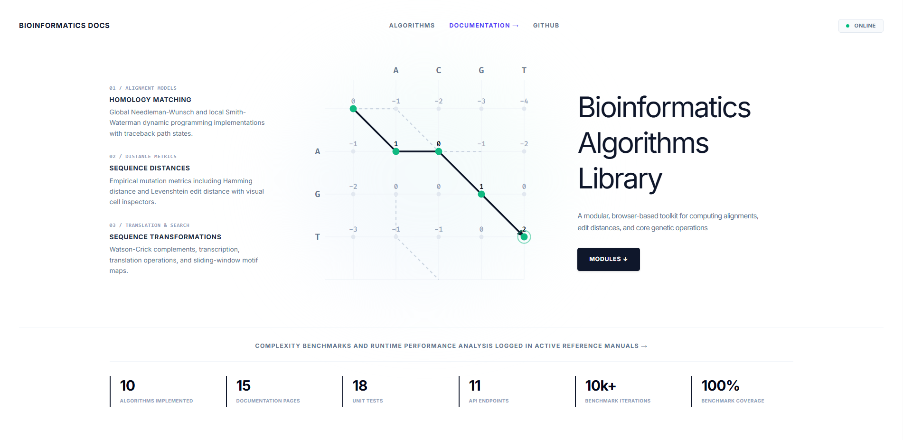
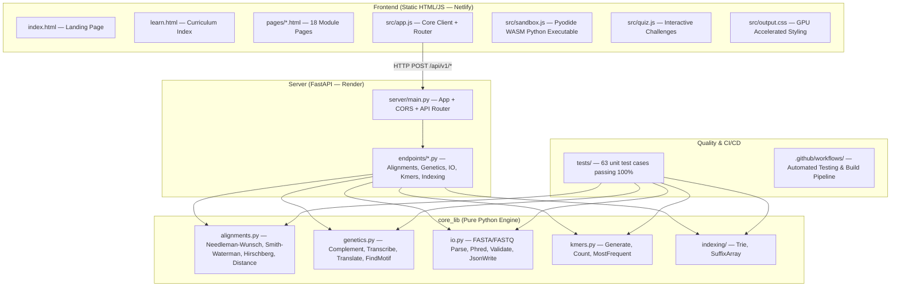

# Bioinformatics Docs

An interactive platform and Python bioinformatics toolkit implementing sequence alignment, distance metrics, pattern matching, indexing, assembly, probabilistic models, variant calling, single-cell transcriptomics, and genomic AI.

[Documentation](https://bioinformatics-docs.netlify.app/pages/docs.html) • [Curriculum Modules](https://bioinformatics-docs.netlify.app/learn.html) • [Glossary](https://bioinformatics-docs.netlify.app/glossary.html) • [Website](https://bioinformatics-docs.netlify.app/) • [Source Code](https://github.com/ChakradhwajB/Bioinformatics-Docs)

---



---

## Interactive Curriculum Modules (18 Modules)

### Module 1 &bull; Foundations
- **FASTA File IO** (`io.html`): Streaming line-by-line parsing, header extraction, sequence sanitization, and structured JSON serialization.
- **FASTQ QC &amp; Phred Scores** (`fastq_qc.html`): Quality score decoding ($P = 10^{-Q/10}$), read filtering, and quality stats calculation.
- **Genetics Workbench** (`genetics.html`): Strand complementation, reverse complementation, DNA-to-RNA transcription, and codon table translation.

### Module 2 &bull; Patterns &amp; Motifs
- **K-mer Profiler** (`kmers.html`): Sliding-window substring extraction, frequency distribution tables, and top $k$-mer profiling.
- **Motif Finder** (`find_motif.html`): Exact pattern matching across genomic sequences with spotlight visualizer.

### Module 3 &bull; Sequence Comparisons
- **Dot Plot Visualizer** (`dot_plot.html`): 2D graphical dot matrix analysis for sequence similarity and synteny.
- **Sequence Distances** (`distances.html`): Hamming mutation distance and Levenshtein DP edit distance matrix.

### Module 4 &bull; Alignments
- **Needleman-Wunsch** (`needleman_wunsch.html`): Global homology alignments using dynamic programming with interactive grid traceback.
- **Smith-Waterman** (`smith_waterman.html`): Local sequence alignment identifying optimal high-scoring local regions.
- **Affine Gap Penalties** (`affine_gaps.html`): Gotoh's 3-matrix finite state machine modeling insertion/deletion events ($g_o + k \cdot g_e$).

### Module 5 &bull; Indexing &amp; Genome Assembly
- **Trie Multi-Search** (`trie.html`): Prefix tree multi-pattern dictionary indexing.
- **Suffix Array Search** (`suffix_array.html`): $\mathcal{O}(N \log^2 N)$ prefix-doubling suffix array construction and binary search pattern lookup.
- **BWT &amp; FM-Index Mapping** (`bwt_fm_index.html`): Burrows-Wheeler Transform, Last-First (LF) mapping, and FM-Index compressed read alignment.
- **De Bruijn Graph Assembly** (`de_bruijn.html`): Eulerian path genome assembly simulation from short overlap $k$-mers.

### Module 6 &bull; Advanced Probabilistic Models &amp; Variant Calling
- **HMMs &amp; Viterbi Decoding** (`hmm_viterbi.html`): Hidden Markov Models, transition/emission matrices, and Viterbi dynamic programming decoding.
- **Variant Calling &amp; VCFs** (`vcf_caller.html`): Bayesian allele frequency modeling, genotype likelihoods, and VCF standard record parsing.

### Module 7 &bull; Functional Genomics &amp; AI
- **Single-Cell RNA-Seq** (`scrna_seq.html`): Single-cell transcriptomics, UMI count matrix normalization, HVG selection, PCA, and UMAP clustering.
- **Deep Learning &amp; Genomic AI** (`genomic_ai.html`): One-hot encoding, 1D CNNs, self-attention Transformer blocks, and foundation models (Enformer, Nucleotide Transformer).

---

## Installation

Clone the repository and install dependencies:

```bash
git clone https://github.com/ChakradhwajB/Bioinformatics-Docs.git
cd Bioinformatics-Docs
pip install -r requirements.txt
```

---

## Quick Start

You can run calculations directly in Python or launch the local interactive web dashboard.

#### 1. Global Sequence Alignment

```python
from core_lib.alignments import NeedlemanWunsch

# Align sequences with Match=1, Mismatch=-1, Gap=-1 penalties
score, align1, align2 = NeedlemanWunsch(
    "GCATGCG",
    "GATTACA",
    match=1,
    mismatch=-1,
    gap=-1
)

print(f"Alignment Score: {score}")
print(f"Seq 1: {align1}")
print(f"Seq 2: {align2}")
```

#### 2. FASTQ Phred Score Decoding

```python
from core_lib.io import FastqParse, CalculateQualityStats

fastq_lines = [
    "@READ1",
    "AGCT",
    "+",
    "IHH?"
]

parsed = FastqParse(fastq_lines)
stats = CalculateQualityStats(parsed["records"])
print(f"Read Count: {parsed['read_count']}")
print(f"Overall Avg Q: {stats['overall_avg_q']}")
print(f"Q30 Percentage: {stats['q30_percentage']}%")
```

### Local Quick Start

Start the FastAPI backend server:

```bash
python -m uvicorn server.main:app --reload
```

Then, double-click `frontend/index.html` to open the interactive web application in your browser.

---

## Implemented Core Algorithms

| Algorithm | Category | Time Complexity | Space Complexity |
| :--- | :--- | :--- | :--- |
| **Hamming Distance** | Distance Metric | $\mathcal{O}(L)$ | $\mathcal{O}(1)$ |
| **Levenshtein Distance** | Distance Metric | $\mathcal{O}(N \cdot M)$ | $\mathcal{O}(N \cdot M)$ |
| **Needleman-Wunsch** | Global Alignment | $\mathcal{O}(N \cdot M)$ | $\mathcal{O}(N \cdot M)$ |
| **Smith-Waterman** | Local Alignment | $\mathcal{O}(N \cdot M)$ | $\mathcal{O}(N \cdot M)$ |
| **Gotoh Affine Gaps** | Affine Alignment | $\mathcal{O}(N \cdot M)$ | $\mathcal{O}(N \cdot M)$ |
| **Complement / RevComp** | Sequence Transform | $\mathcal{O}(N)$ | $\mathcal{O}(N)$ |
| **Transcription / Translation** | Sequence Transform | $\mathcal{O}(N)$ | $\mathcal{O}(N)$ |
| **Motif Search** | Pattern Matching | $\mathcal{O}(N \cdot M)$ | $\mathcal{O}(N)$ |
| **FASTA / FASTQ Parser** | File IO | $\mathcal{O}(N)$ | $\mathcal{O}(1)$ (Streaming) |
| **Trie Dictionary** | Indexing | $\mathcal{O}(N \cdot L)$ | $\mathcal{O}(\Sigma \cdot N \cdot L)$ |
| **Suffix Array (Prefix Doubling)** | Indexing | $\mathcal{O}(N \log^2 N)$ | $\mathcal{O}(N)$ |

---

## System Architecture Overview



---

## Testing & Quality Verification

Run pytest locally to execute the complete 63-test assertion suite:

```bash
pytest
```

Output:
```text
======================== 63 passed, 1 warning in 6.58s ========================
```

---

## Roadmap

### Completed
- [x] **Linear-space alignments** using Hirschberg's algorithm.
- [x] **Gotoh's Affine Gap Penalty** 3-matrix algorithm.
- [x] **Suffix Array** with $\mathcal{O}(N \log^2 N)$ prefix-doubling construction.
- [x] **BWT & FM-Index** compressed read mapping.
- [x] **De Bruijn Graphs** for genome assembly simulation.
- [x] **Hidden Markov Models** and Viterbi decoding.
- [x] **Variant Calling & VCF** Bayesian likelihood modeling.
- [x] **Single-Cell RNA-Seq** clustering and UMAP visualization.
- [x] **Genomic AI Foundation Models** (CNNs, Transformers, Enformer).
