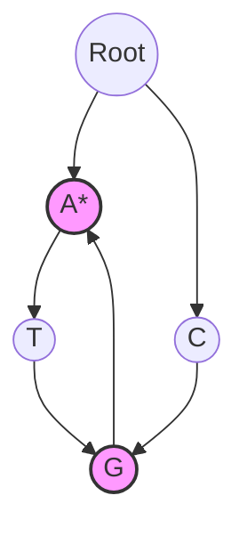

# Trie (Prefix Tree) Multi-Pattern Search

A **Trie** (derived from "retrieval") is an ordered tree data structure used to store a dynamic set of associative key strings, where keys are usually strings.

Unlike binary search trees, no node in the tree stores the key associated with that node; instead, its position in the tree defines the key with which it is associated. All descendants of a node share a common prefix of the string associated with that node.

---

## 1. Algorithmic Mechanics

When searching for multiple motifs concurrently in a sequence:
1. We construct a Trie from the set of target patterns.
2. We iterate through each starting position $i$ in the genomic sequence.
3. Starting from index $i$, we traverse down the Trie matches base by base.
4. If we reach a node marked as the end of a pattern, we record a match starting at index $i$.
5. If we cannot match the next character in the Trie children, we stop searching for start position $i$ and advance to $i+1$.

---

## 2. Complexity

* **Space Complexity (Trie construction):** $\mathcal{O}(\sum |P_i| \cdot |\Sigma|)$ where $P_i$ is the length of pattern $i$, and $\Sigma$ is the alphabet size (for DNA, $|\Sigma| = 4$).
* **Time Complexity (Multi-Pattern Match):** $\mathcal{O}(N \cdot L)$ where $N$ is the sequence length and $L$ is the maximum pattern length. This is much faster than running independent sequential sliding window matching $\mathcal{O}(M \cdot N)$ for $M$ patterns of length $L$.
